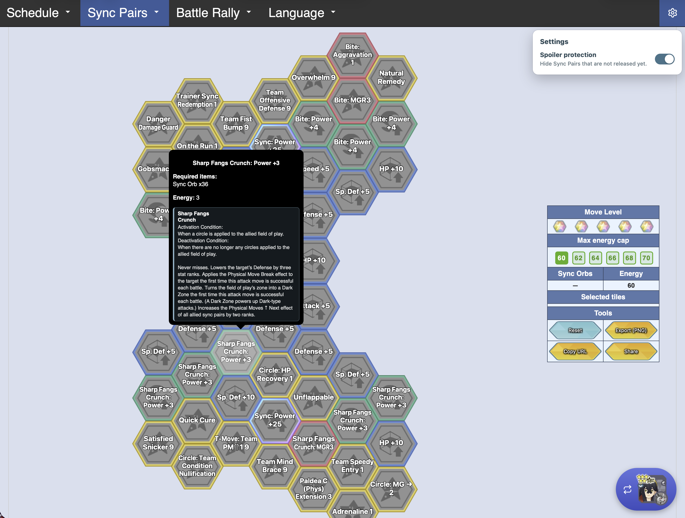
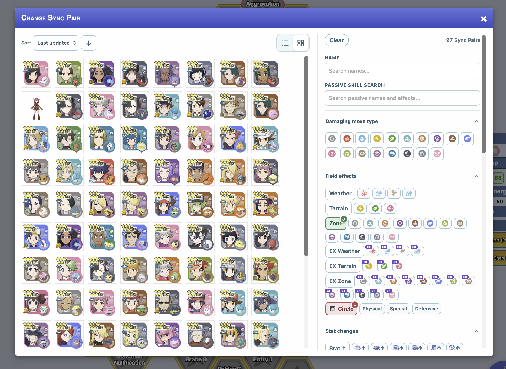

# Brybry Pokemas Enhancer

A plain-JavaScript userscript that improves the Sync Pair page at `pokemon.brybry.ch`. Development happens in small, responsibility-based files under `src/`; users still install one generated file from the repository root.

[Install Brybry Pokemas Enhancer](https://raw.githubusercontent.com/charlie5188/brybry-pokemas-enhancer/main/brybry-enhancer.user.js)

> `brybry-enhancer.user.js` is generated. Do not edit it directly. Change `src/`, then run `npm run build`.

## Features

### Readable, responsive Sync Grids

- Shows useful labels directly inside each tile, with up to four lines and responsive 9–16px text.
- Uses localized PomaTools abbreviations only when the full label does not fit. Tooltips always keep the complete name and details.
- Displays compact, consistent labels for Sync Move power nodes, while leaving regular move and stat nodes unchanged.
- Adds related move descriptions to compact Grid tooltips and scales the Grid to make better use of the viewport.
- Places Sync Grid before Stats and remembers a separate Grid configuration for each Sync Pair.



### A faster Sync Pair picker

- Uses a roomy two-column layout: Sync Pair results on the left and searchable filters on the right.
- Supports compact icon view and detailed list view, using Brybry's original pair artwork with graceful image fallbacks.
- Searches pair names and full move, passive-skill and description text, with multi-select skill tags.
- Sorts by latest update by default, with release date, Sync Pair number, Pokédex number, trainer name, type and rarity also available.
- Keeps result count and reset controls visible while browsing long filter lists.



### Structured filters, not just keywords

- Pair identity: Type, Weakness, damaging-move Type, Role, EX Role, Role Combination, initial stars and Superawakening.
- Availability: acquisition method, scout type and region.
- Trainer tags: trainer group, fashion and other team-skill tags.
- Battle effects: Weather, Terrain, Zone and their EX variants; Circle; stat changes; status and interference effects; type resistance reduction; and Master Passive categories.
- Every filter cycles through include, exclude and off states. Expensive result updates are delayed so several choices can be made smoothly.

### Preferences and spoiler protection

- Optional spoiler protection hides unreleased pairs, redirects direct unreleased-pair links, and hides Brybry's Last update section. It is off by default.
- Remembers picker view, sorting, spoiler setting, Accordion state and per-pair Sync Grid configurations locally.
- Keeps the floating Sync Pair launcher available while scrolling.

Pair names and filter metadata continue to come from Brybry's current data files. No separate Sync Pair catalog is maintained.

Brybry's structured ability, move, passive-skill and localized message data are resolved into complete searchable text. New Sync Pairs and supported skill templates therefore become available without maintaining a manual pair-ID list.

The enhancer follows Brybry's content-language URL/cookie and supports the same eight languages: English, French, German, Spanish, Italian, Japanese, Korean and Traditional Chinese. Localized game terms and skill text come from Brybry; authored Grid abbreviations come from PomaTools.

The current abbreviation snapshot is generated from PomaTools commit `47943a730951580152bae7fa3d223c9ac97f80b1`.

## Install

1. Install Tampermonkey in a supported browser.
2. Open the install link above and confirm installation.
3. Open or reload the Brybry Pokemas Sync Pair page.

The generated root file remains a self-contained userscript with its metadata header at the first byte. The existing Codex/Playwright development workflow can continue injecting that same file into the live page without a userscript manager.

## Development

Requires Node.js 20 or newer.

```sh
npm ci
npm run dev
```

`npm run dev` watches `src/` and rebuilds the root userscript after each save.

Available commands:

- `npm run build` — bundles all source, CSS and data into `brybry-enhancer.user.js` using esbuild.
- `npm run dev` — builds once, then watches `src/`.
- `npm run check` — rebuilds in memory and checks metadata placement, JavaScript syntax and that the committed generated file is current.
- `npm test` — alias for `npm run check`.
- `npm run update:pomatools -- /path/to/pomatools.github.io` — regenerates the eight locale-specific abbreviation datasets from a PomaTools checkout.

Before opening a pull request, run:

```sh
npm run build
npm run check
```

Commit both the source changes and the regenerated root userscript. CI repeats the build and fails if the committed artifact differs.

## Project structure

```text
src/
  index.js                 Initialization and feature orchestration
  config.js                URLs, storage keys and shared configuration
  i18n.js                  Locale detection data and UI copy
  state.js                 Shared runtime state and defaults
  storage.js               Picker preferences and per-pair Sync Grid builds
  spoiler-protection.js    Spoiler redirect, settings and sensitive sections
  styles.css               All injected styles
  styles.js                Style element mounting
  data/
    index.js               Brybry loading, indexes and skill-search text
    pomatools-abbreviations/
      *-skills.json        Locale-specific authored Grid skill abbreviations
      *-moves.json         Locale-specific authored move abbreviations
  grid/
    index.js               Labels, wrapping, responsive sizing and tooltips
  picker/
    index.js               Dialog, filters, sorting and list/icon results
scripts/
  build.js                 Deterministic esbuild pipeline and watch mode
  check.js                 Artifact, metadata and syntax checks
```

The JavaScript files are plain source modules combined in the fixed order declared by `scripts/build.js`. They intentionally share the userscript's single runtime scope, which preserves the current behavior without introducing a framework or runtime module loader. Put changes in the narrowest relevant source file; keep large static datasets in `src/data/`.

## License and attribution

Project source code is available under the [MIT License](LICENSE). Generated
PomaTools abbreviation datasets are excluded from that license; see
[NOTICE.md](NOTICE.md) for their source and attribution.

This is an unofficial, fan-made project. Pokémon, Pokémon Masters EX, and
related names and assets belong to their respective owners. The project is not
affiliated with or endorsed by Pokémon, DeNA, Nintendo, Creatures, GAME FREAK,
Brybry, or PomaTools.
