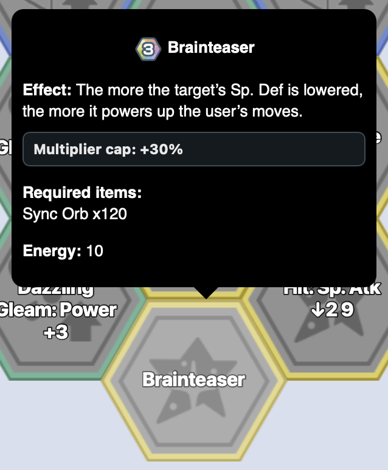
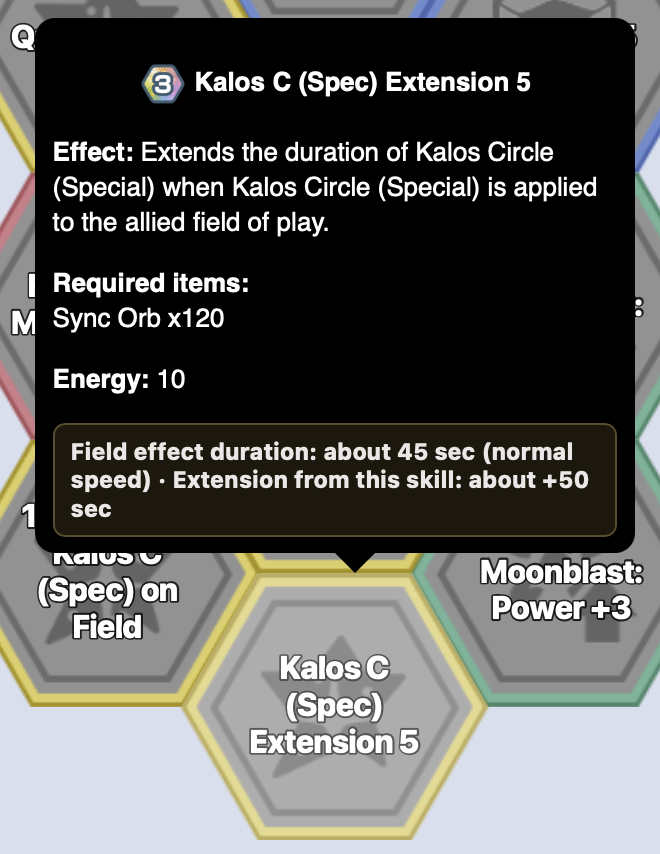
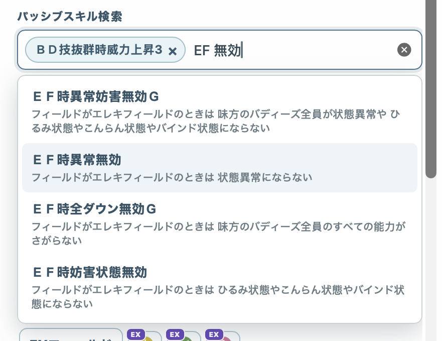

# Brybry Pokemas Enhancer

A plain-JavaScript userscript that improves the Sync Pair page at `pokemon.brybry.ch`. Development happens in small, responsibility-based files under `src/`; users still install one generated file from the repository root.

[Install Brybry Pokemas Enhancer](https://raw.githubusercontent.com/charlie5188/brybry-pokemas-enhancer/main/brybry-enhancer.user.js)

> `brybry-enhancer.user.js` is generated. Do not edit it directly. Change `src/`, then run `npm run build`.

## Features

### Better Sync Grids


- Adds readable labels directly to Grid tiles and makes better use of the screen.
- Shows Move Level requirements and useful move details in tooltips; unavailable tiles are clearly dimmed.
- Reveals otherwise hidden effect details in tooltips, including actual power multipliers, multiplier caps, field-effect durations and duration extensions when verified values are available.  
- Remembers selected tiles, Move Level and Max Energy Cap for each Sync Pair.

### A faster Sync Pair picker

- Quickly searches Sync Pairs by name, moves, passive skills and effects.
- Filters by traits such as type, role, availability, region and battle effects.
- Supports icon and list views with several useful sorting options.




### Player preferences

- Optional spoiler protection hides unreleased Sync Pairs.
- Remembers your picker, sorting and Grid preferences locally.
- Supports the same eight languages as Brybry.

## Install

1. Install Tampermonkey in a supported browser.
2. Open the install link above and confirm installation.
3. Open or reload the Brybry Pokemas Sync Pair page.

The generated root file remains a self-contained userscript with its metadata header at the first byte. The existing Codex/Playwright development workflow can continue injecting that same file into the live page without a userscript manager.

## Development

Requires Node.js 20 or newer.

```sh
npm ci
npm run dev
```

`npm run dev` watches `src/` and rebuilds the root userscript after each save.

Available commands:

- `npm run build` — bundles all source, CSS and data into `brybry-enhancer.user.js` using esbuild.
- `npm run dev` — builds once, then watches `src/`.
- `npm run check` — rebuilds in memory and checks version consistency, metadata placement, JavaScript syntax and that the committed generated file is current.
- `npm test` — alias for `npm run check`.
- `npm run update:pomatools -- /path/to/pomatools.github.io` — regenerates the eight locale-specific abbreviation datasets from a PomaTools checkout.

Before opening a pull request, run:

```sh
npm run build
npm run check
```

Commit both the source changes and the regenerated root userscript. CI fails if the committed artifact differs and requires a patch-version increment when product source changes.

## Project structure

```text
src/
  index.js                 Initialization and feature orchestration
  config.js                URLs, storage keys and shared configuration
  i18n.js                  Locale detection data and UI copy
  state.js                 Shared runtime state and defaults
  storage.js               Picker preferences, Grid builds, Move Level and energy caps
  spoiler-protection.js    Spoiler redirect, settings and sensitive sections
  styles.css               All injected styles
  styles.js                Style element mounting
  data/
    index.js               Brybry loading, indexes and skill-search text
    pomatools-abbreviations/
      *-skills.json        Locale-specific authored Grid skill abbreviations
      *-moves.json         Locale-specific authored move abbreviations
  grid/
    index.js               Labels, tooltips, Move Level states and responsive sizing
  picker/
    index.js               Dialog, filters, sorting and list/icon results
scripts/
  build.js                 Deterministic esbuild pipeline and watch mode
  check.js                 Artifact, metadata and syntax checks
```

The JavaScript files are plain source modules combined in the fixed order declared by `scripts/build.js`. They intentionally share the userscript's single runtime scope, which preserves the current behavior without introducing a framework or runtime module loader. Put changes in the narrowest relevant source file; keep large static datasets in `src/data/`.

## License and attribution

Project source code is available under the [MIT License](LICENSE). Generated
PomaTools abbreviation datasets are excluded from that license; see
[NOTICE.md](NOTICE.md) for their source and attribution.

This is an unofficial, fan-made project. Pokémon, Pokémon Masters EX, and
related names and assets belong to their respective owners. The project is not
affiliated with or endorsed by Pokémon, DeNA, Nintendo, Creatures, GAME FREAK,
Brybry, or PomaTools.
